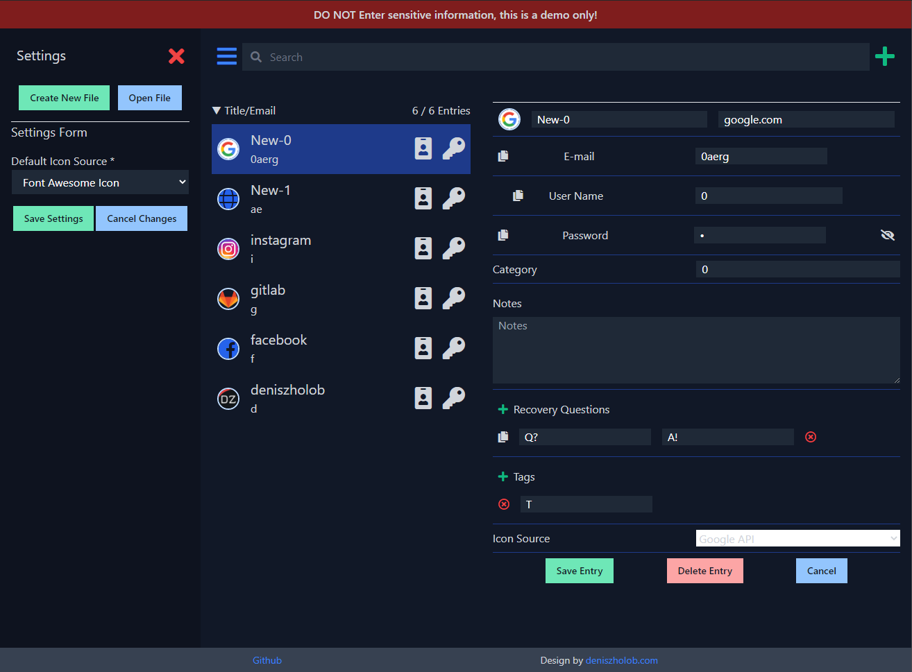

# Password Manager 
Privacy centric, open source password manager app designed for offline use.  
Saves a passwords collection file on your file system only.

> Try the [Web Demo](https://deniszholob.github.io/password-manager/) 
> If you would like to contribute to the code, see [contributing details](CONTRIBUTING.md)

## Rationale
Most other password manager tools are connected online.  
Storing passwords in the cloud can be worrying for some.  
This tool allows you to have full control of where you store your password data.  
It works like any other desktop app, open a file, save a file.  
You can store it on your laptop, or a USB Drive or your NAS, or your Cloud Drive (Dropbox, etc..) folder if you wish.  
You can choose to encrypt the file contents (will need to remember your encryption key/password), or not (data will be in plain text and anyone can read it if they find it)  
The app generates a settings file that can store your key, and itself can be encrypted or not (using its own key that you do not have to remember, but will be the same for everyone using the app)
> There is no absolute security, just better security, and all security measures will have their pros and cons.

# Installation
* Download the [Latest Release](https://github.com/deniszholob/password-manager/releases/latest) under the `Assets` dropdown.
* Run the installer.
* Open the app.

# [Support Me](https://www.patreon.com/deniszholob)
If you find the app or the source code useful, consider supporting me on [Patreon](https://www.patreon.com/deniszholob).

# Screenshots

